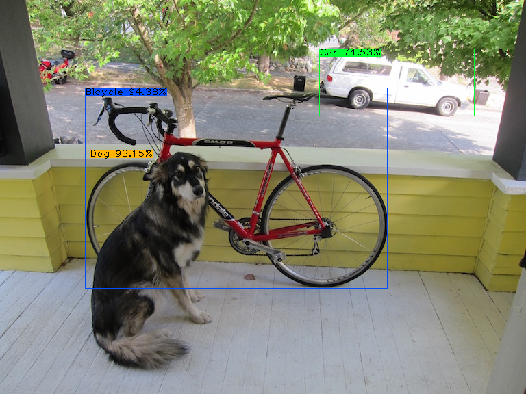
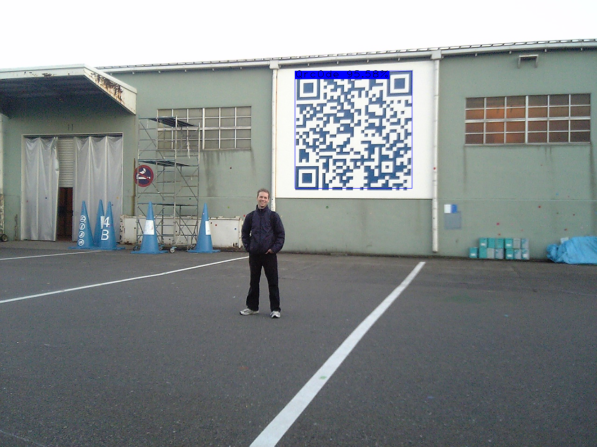

# VisionSharp

基于 OpenCvSharp 封装的机器视觉库，提供目标检测（YOLO）、布局检测、特征提取、标定与数独求解等处理器。

## 构建与依赖

- 目标框架：net48 / net10.0-windows（SDK 风式项目，`dotnet build src/VisionSharp.sln`）
- 主要依赖：OpenCvSharp4、Numpy（**需要本机安装 Python 运行时**，用于 YOLO7 解码）、CommunityToolkit.Mvvm、ZXing.Net
- 测试：`dotnet test src/UnitTest/UnitTest.csproj`（依赖本机模型与图像的测试需要本地资产）

## 模块概览

| 模块 | 说明 |
|---|---|
| `Processor` | 处理器基类，`Call` 模板方法：Process → GetReliability → Draw |
| `Processor.ObjectDetector` | YOLO3 / YOLO7 目标检测 |
| `Processor.LayoutDetectors` | 深度学习 / SVM 布局检测 |
| `Processor.FeatureExtractors` | 圆检测、圆阵列、直径等特征提取 |
| `Processor.Analyzer` | 模板定位、偏移计算、占空比统计 |
| `Processor.Solvers` | 数独求解器 |
| `Processor.TextDetectors` | 条码 / 二维码检测 |
| `Calibration` | 相机标定（棋盘格 / 圆网格）、九点标定、相对偏移模型 |
| `Utils` | Cv 坐标/类型转换、几何计算、绘制扩展 |

## 使用约定

- `Call(input)` 直接返回处理结果，异常会抛出
- `Call(input, mat)` 返回 `RichInfo<T>`（含结果、可靠度、绘制后的图像）；
  `RichInfo` 持有 `OutMat`，用完请 `Dispose`
- 处理器持有非托管资源（DNN 网络等），用完请 `Dispose`
- 默认不落盘；设置 `EnableSaveMat = true` 后按 `OutputDirectory` 保存 PNG
- 处理器不会修改调用方传入的 Mat（内部自行克隆）

## Object Detector

### Yolo7 VOC

```c#
var modelPath = @"path/to/yolo7.onnx";
var imagePath = @"path/to/image.jpg";

var d = new ObjDetYolo7<VocCategory>(modelPath)
{
    Confidence = 0.4f,
    IouThreshold = 0.5f
};
using var mat = Cv2.ImRead(imagePath);
var res = d.Call(mat, mat);
PrintObject(res.Result);

Cv2.ImShow("result", res.OutMat);
Cv2.WaitKey();
```



### Yolo7 QRCode

```c#
var d = new ObjDetYolo7<QrCategory>(QRModelPath)
{
    Confidence = 0.6f,
    IouThreshold = 0.5f
};

using var mat = Cv2.ImRead(imagePath);
var res = d.Call(mat, mat);
PrintObject(res.Result);

Cv2.ImShow("result", res.OutMat);
Cv2.WaitKey();
```



## TextDetector

### 二维码检测器 BarcodeDetector

```C#
var barcodeDetector = new BarcodeDetector();
using var mat = Cv2.ImRead(@"path/to/barcode.png");
var code = barcodeDetector.Call(mat);
```

## Solver

###  数独解答器 SudokuSolver

```C#
byte[,] _demo =   {
                {5, 3, 0, 0, 7, 0, 0, 0, 0},
                {6, 0, 0, 1, 9, 5, 0, 0, 0},
                {0, 9, 8, 0, 0, 0, 0, 6, 0},
                {8, 0, 0, 0, 6, 0, 0, 0, 3},
                {4, 0, 0, 8, 0, 3, 0, 0, 1},
                {7, 0, 0, 0, 2, 0, 0, 0, 6},
                {0, 6, 0, 0, 0, 0, 2, 8, 0},
                {0, 0, 0, 4, 1, 9, 0, 0, 5},
                {0, 0, 0, 0, 8, 0, 0, 7, 9}
            };
var sudokuSubject = new Sudoku(_demo);
var solve = new SudokuSolver();
var answer = solve.Call(sudokuSubject);
```
