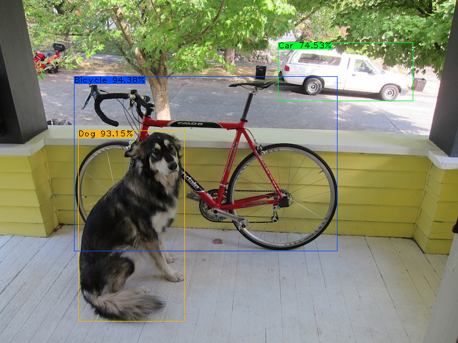
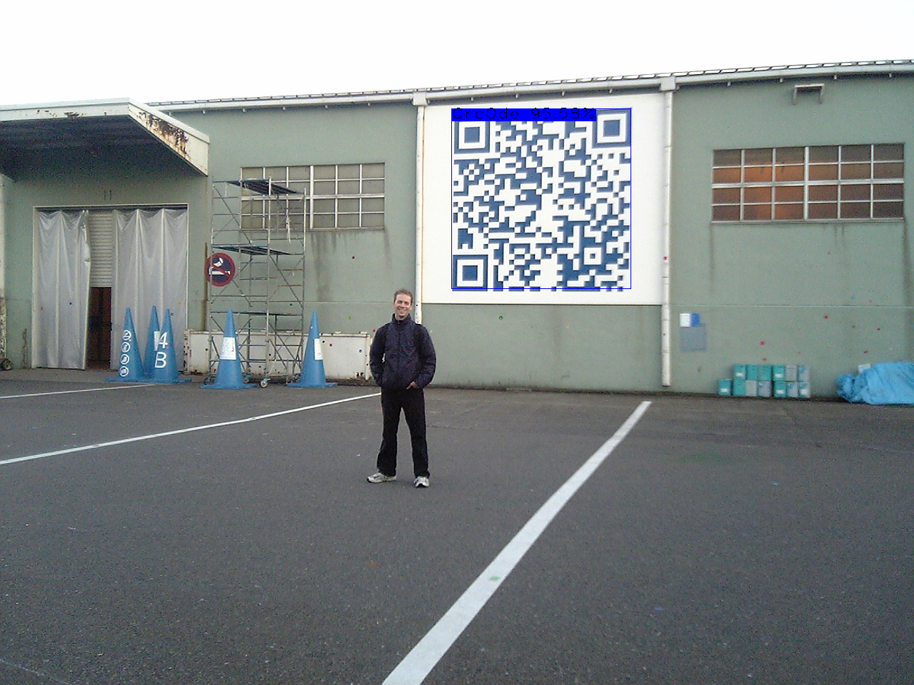

# vision_sharp
基于Opencv模块封装的的机器视觉库


## Object Detector

### Yolo7 VOC

``` C#
var d = new ObjDetYolo7<VocCategory>(VocModelPath)
{
    Confidence = 0.4f,
    IouThreshold = 0.5f
};
var image = @"E:\OneDrive - II-VI Incorporated\Pictures\Saved Pictures\voc\dog.jpg";
var mat = Cv2.ImRead(image);
var res = d.Call(mat, mat);
PrintObject(res.Result);

Cv2.ImShow("result", res.OutMat);
Cv2.WaitKey();
 ```



### Yolo7 QRCode

``` C#
var d = new ObjDetYolo7<QrCategory>(QRModelPath)
{
    Confidence = 0.6f,
    IouThreshold = 0.5f
};
var image = @"F:\QR\JPEGImages\0179583169.jpg";
var mat = Cv2.ImRead(image);
var res = d.Call(mat, mat);
PrintObject(res.Result);

Cv2.ImShow("result", res.OutMat);
Cv2.WaitKey();

 ```



## TextDetector

### 二维码检测器 BarcodeDetector

```C#
var barcodeDetector = new BarcodeDetector();
var mat = Cv2.ImRead(@"..\..\..\..\testimages\barcode.png");
var code = barcodeDetector.Call(mat);
```

## Slover

###  数独解答器 SudokuSolver

```C#
byte[,] _demo =   {
                {5, 3, 0, 0, 7, 0, 0, 0, 0},
                {6, 0, 0, 1, 9, 5, 0, 0, 0},
                {0, 9, 8, 0, 0, 0, 0, 6, 0},
                {8, 0, 0, 0, 6, 0, 0, 0, 3},
                {4, 0, 0, 8, 0, 3, 0, 0, 1},
                {7, 0, 0, 0, 2, 0, 0, 0, 6},
                {0, 6, 0, 0, 0, 0, 2, 8, 0},
                {0, 0, 0, 4, 1, 9, 0, 0, 5},
                {0, 0, 0, 0, 8, 0, 0, 7, 9}
            };
var sudokuSubject = new Sudoku(_demo);
var solve = new SudokuSolver();
var answer = solve.Call(sudokuSubject);
```